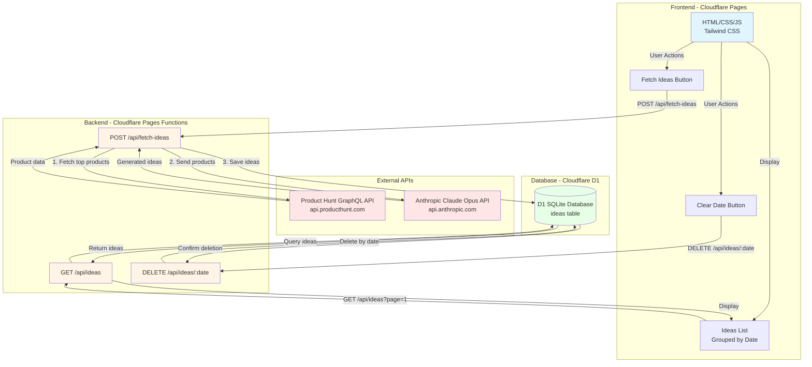

# Architecture Overview

## System Architecture



## Data Flow

### Fetch Ideas Flow

```
1. User clicks "Fetch Today's Ideas" or "Fetch Past 2 Days"
   ↓
2. Frontend sends POST /api/fetch-ideas?daysBack=0 (or 2)
   ↓
3. Pages Function (fetch-ideas.ts):
   a. Fetches top products from Product Hunt GraphQL API
      - Query: posts(first: 3 or 6, order: VOTES)
      - Returns: name, tagline, description, url, votesCount, thumbnail
   ↓
   b. Sends products to Claude Opus API
      - Prompt: "Analyze these products and generate 2 mini ideas each"
      - Returns: JSON array with mini_ideas for each product
   ↓
   c. Combines Product Hunt data with Claude ideas
   ↓
   d. Saves to D1 database (ideas table)
      - Stores: date, ph_name, ph_tagline, ph_url, ph_upvotes, ph_image, mini_idea (JSON)
   ↓
4. Returns success response to frontend
   ↓
5. Frontend reloads ideas list
```

### Display Ideas Flow

```
1. Page loads or user scrolls
   ↓
2. Frontend sends GET /api/ideas?page=1&limit=10
   ↓
3. Pages Function (ideas.ts):
   a. Queries D1 database
      - SELECT * FROM ideas ORDER BY date DESC, created_at DESC
      - Pagination: LIMIT/OFFSET
   ↓
   b. Groups ideas by date
   ↓
   c. Returns JSON: { ideas: { date: [...ideas] }, hasMore, page }
   ↓
4. Frontend renders ideas grouped by date
   - Infinite scroll loads more pages
```

### Clear Date Flow

```
1. User clicks "Clear" button on a date section
   ↓
2. Frontend sends DELETE /api/ideas/:date
   ↓
3. Pages Function (ideas/[date].ts):
   a. Deletes all ideas for that date
      - DELETE FROM ideas WHERE date = ?
   ↓
   b. Returns success response
   ↓
4. Frontend reloads ideas list
```

## Technology Stack

| Layer | Technology | Purpose |
|-------|-----------|---------|
| **Frontend** | HTML/CSS/JS + Tailwind CSS | User interface, displays ideas |
| **Hosting** | Cloudflare Pages | Static site hosting + Functions |
| **Backend** | Cloudflare Pages Functions | API endpoints (TypeScript) |
| **Database** | Cloudflare D1 | SQLite database for storing ideas |
| **External APIs** | Product Hunt GraphQL API | Fetch trending products |
| **AI** | Anthropic Claude Opus | Generate simplified build ideas |

## Database Schema

```sql
CREATE TABLE ideas (
  id INTEGER PRIMARY KEY AUTOINCREMENT,
  date TEXT NOT NULL,              -- YYYY-MM-DD format
  ph_name TEXT NOT NULL,            -- Product name
  ph_tagline TEXT,                  -- Full description stored here
  ph_url TEXT NOT NULL,             -- Product Hunt URL
  ph_upvotes INTEGER NOT NULL,      -- Upvote count
  ph_image TEXT,                    -- Product thumbnail URL
  mini_idea TEXT NOT NULL,          -- JSON array of mini ideas
  created_at TEXT NOT NULL          -- Timestamp
);

CREATE INDEX idx_date ON ideas(date);
CREATE INDEX idx_created_at ON ideas(created_at);
```

## API Endpoints

### POST /api/fetch-ideas
- **Query Params**: `daysBack` (0 = today only, 2 = past 2 days)
- **Function**: `functions/api/fetch-ideas.ts`
- **Flow**: Product Hunt → Claude → Database

### GET /api/ideas
- **Query Params**: `page`, `limit`
- **Function**: `functions/api/ideas.ts`
- **Returns**: Ideas grouped by date with pagination

### DELETE /api/ideas/:date
- **Path Param**: `date` (YYYY-MM-DD)
- **Function**: `functions/api/ideas/[date].ts`
- **Action**: Deletes all ideas for specified date

## Environment Variables

- `ANTHROPIC_API_KEY` - Claude API authentication
- `PRODUCT_HUNT_API_TOKEN` - Product Hunt Developer Token
- `IDEAS_DB` - D1 database binding (configured in wrangler.toml)

## Deployment

- **Frontend**: Deployed to Cloudflare Pages
- **Functions**: Automatically deployed with Pages
- **Database**: Cloudflare D1 (serverless SQLite)
- **URL**: https://new-ideas.pages.dev

